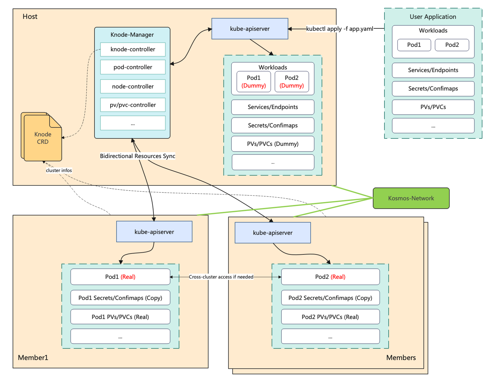

# KOSMOS

> English | [中文](README_zh.md)

Kosmos is an open-source, all-in-one distributed cloud-native solution. The name "kosmos" combines 'k' representing Kubernetes and 'cosmos' which means universe in Greek, symbolizing the limitless expansion of Kubernetes. Currently, Kosmos primarily consists of three major modules: ClusterLink, ClusterTree and Scheduler. Additionally, Kosmos is equipped with a tool called kosmosctl, which allows for quick deployment of Kosmos components, adding clusters, and testing network connectivity.

## ClusterLink

The target of Kosmos networking is to establish connectivity between multiple Kubernetes clusters. This module can be deployed and used independently. Kosmos networking enables `Pods` to access `Pods` and `Services` across clusters, as if they were in the same cluster. Currently, this module primarily offers the following ability:
1. **Cross-cluster PodIP and ServiceIP Make communication**: Linux vxlan base on tunneling technology, this enables L3 network connectivity across multiple Kubernetes clusters. This allows users to conduct `Pod-to-Pod` and `Pod-to-Service` communication within the global clusters scope.
2. **Multi-Mode Support**: When join clusters, you can choose `P2P` or `Gateway` mode. When selecting the `P2P` mode, it is applicable for underlay network interconnection,offering shorter network paths and superior performance. When selecting the `Gateway` mode, it demonstrates superior compatibility, which is well-suited for hybrid and multi-cloud scenarios.
3. **Support for Global IP Allocation**: Kosmos networking allows for the presence of two or more clusters within the global clusters to use the same `Pod/Service` network segments, making it convenient for users to manage subnet. Kosmos supports configuring the mapping relationship between `PodCIDR/ServiceCIDR` and `GlobalCIDR`. `GlobalIP` is globally unique, enabling cross-cluster communication for services with conflicting network segments through `GlobalIP`.
4. **IPv6/IPv4 Dual-Stack Support**

### Network Architecture

The Kosmos ClusterLink module currently includes the following key components:
<div></div>

- `Controller-Manager`：Collectes network information of the current cluster and monitors changes in network settings.
- `Network-manager`：Calculates the network configurations required for each node.
- `Agent`：A DaemonSet used for configuring the host network, including tasks such as tunnel creation, routing, NAT, and so on.
- `Multi-Cluster-Coredns`：Implements multi-cluster service discovery.
- `Elector`：Elects the gateway node.

### Quick Start

#### Start Locally

The following command allows you to quickly run an experimental environment locally. This command will use kind (so Docker needs to be installed firstly) to create two Kubernetes clusters and deploy ClusterLink.
```Shell
./hack/local-up-clusterlink.sh
```

Verify if the service is running smoothly.
```Shell
kubectl --context=kind-cluster-host-local get pods -nclusterlink-system
kubectl --context=kind-cluster-member1-local get pods -nclusterlink-system
```

Verify if the cross-cluster network is connected.
```Shell
kubectl --context=kind-cluster-host-local exec -it <any-host-pod> -- ping <any-member1-pod-ip>
```


## ClusterTree

The Kosmos clustertree module realizes the tree-like scaling of Kubernetes and achieves cross-cluster orchestration of applications.
<div></div>

Currently, it primarily supports the following ability:
1. **Full Compatibility with k8s API**: Users can interact with the host cluster's `kube-apiserver` using tools like `kubectl`, `client-go`, and others just like they normally would. However, the `Pods` are actually distributed across the entire multi-cloud, multi-cluster environment.
2. **Support for Stateful and k8s-native Applications**: In addition to stateless applications, Kosmos also facilitates the orchestration of stateful applications and k8s-native applications (interacting with `kube-apiserver`). Kosmos will automatically detect the storage and permission resources that `Pods`depend on, such as pv/pvc, sa, etc., and perform automatic bothway synchronization.
3. **Diverse Pod Topology Constraints**: Users can easily control the distribution of Pods within the global clusters, such as by region, availability zone, cluster, or node. This helps achieve high availability and improve resource utilization.

## Scheduler (Under Construction)

The Kosmos scheduling module is an extension developed on top of the Kubernetes scheduling framework, aiming to meet the container management needs in mixed-node and sub-cluster environments. It provides the following core features to enhance the flexibility and efficiency of container management:

1. **Flexible Node and Cluster Hybrid Scheduling**: The Kosmos scheduling module allows users to intelligently schedule workloads between real nodes and sub-clusters based on custom configurations. This enables users to make optimal use of resources across different nodes, ensuring the best performance and availability of workloads. Based on this capability, Kosmos enables workloads to achieve flexible cross-cloud and cross-cluster deployments.

2. **Fine-grained Container Distribution Strategy**: By introducing Custom Resource Definitions (CRD), users can exert precise control over the distribution of workloads. The configuration of CRD allows users to explicitly specify the number of pods for the workload in different clusters and adjust the distribution ratio as needed.

3. **Fine-grained Fragmented Resource Handling**: The Kosmos scheduling module intelligently detects fragmented resources within sub-clusters, effectively avoiding situations where pod deployment encounters insufficient resources in the sub-cluster. This helps ensure a more balanced allocation of resources across different nodes, enhancing system stability and performance.
   Whether building a hybrid cloud environment or requiring flexible deployment of workloads across different clusters, the Kosmos scheduling module serves as a reliable solution, assisting users in managing containerized applications more efficiently.

## Contact

If you have questions, feel free to reach out to us in the following ways:
- [Email](mailto:wuyingjun@cmss.chinamobile.com)
- [WeChat](./docs/images/kosmos-WechatIMG.jpg)

## Contributors

<a href="https://github.com/kosmos-io/clusterlink/graphs/contributors">
  
</a>

Made with [contrib.rocks](https://contrib.rocks).

## License

Copyright 2023 the KOSMOS Authors. All rights reserved.

Licensed under the Apache License, Version 2.0.


