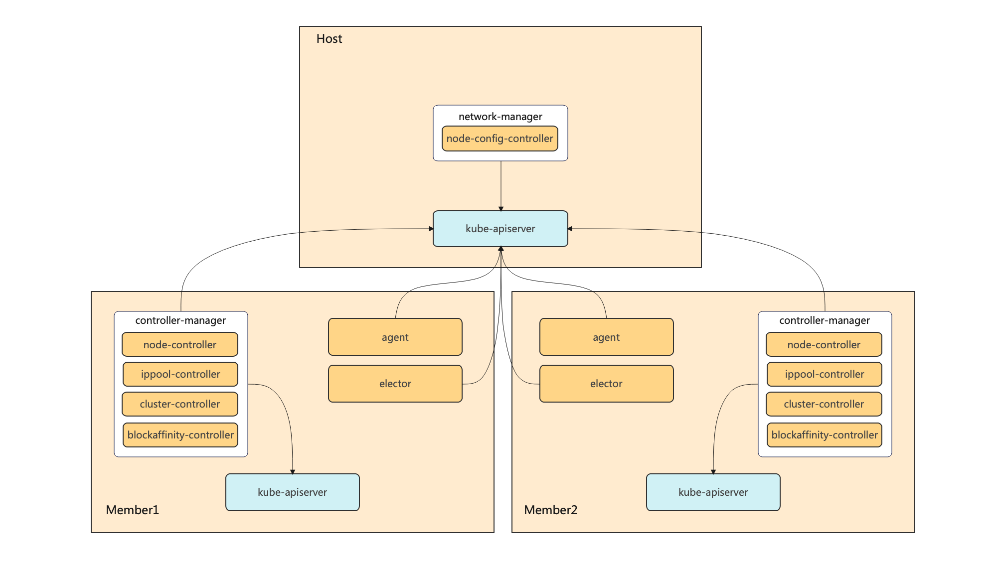

# KOSMOS

## 网络篇
**KOSMOS 网络模块 ClusterLink 致力于提供一套完整的多集群网络解决方案**

### 关于

ClusterLink 可以快速的打通多个 Kubernetes 集群之间的网络，并且支持多种 CNI 插件。ClusterLink 可以轻松纳管已经存在的集群而不会影响已有的服务。

**主要功能**:
- **跨集群L3层网络打通**：Pod 可以跨集群访问 PodIP、ServiceIP，就像它们在同一个集群那样
- **多集群服务发现**：结合 Kosmos-io/multi-cluster-coredns ，可以实现跨集群访问 Service 域名。multi-clusters-coredns 基于 [coredns](https://github.com/coredns/coredns)，顾名思义，它能够解析已纳管集群的 Service 域名
- **支持全局IP分配**：ClusterLink支持配置 PodCIDR/ServiceCIDR 到 GlobalCIDR 的映射，GlobalIP全局唯一，对于存在网段冲突的集群，可以通过 GlobalIP 互访
- Linkctl：一个配套工具，帮助你快速检查多集群网络
- **ClusterLink-Operator**：帮助你快速部署 ClusterLink
- **IPv6/IPv4 双栈支持**

### 架构

<div></div>

ClusterLink 由以下组件组成，各个组件协同工作以打通多集群之间的网络：

- **Network Manager**：运行在主集群中，负责计算各个节点所需的网络配置，并维护到CR `nodeconfigs.kosmos.io` 中
- **Agent**：运行在子集群中，通常是一个Daemonset，从 `nodeconfigs.kosmos.io` 获取当前节点所需的网络配置，配置到节点上
- **Controller Manager**：运行在子集群中，负责维护集群`clusters.kosmos.io`和节点`clusternodes.kosmos.io`的状态，比如：集群节点新增/删除、集群IPPool变更等
- **Elector**：负责gateway模式下集群gw节点选择

### 快速开始

#### 本地启动
通过以下命令可以快速在本地运行一个实验环境，该命令将基于 kind （因此需要先安装docker）创建两个k8s集群，并部署ClusterLink。
```bash
./hack/local-up-clusterlink.sh
```
检查服务是否正常运行
```bash
kubectl --context=kind-cluster-host-local get pods -nclusterlink-system
kubectl --context=kind-cluster-member1-local get pods -nclusterlink-system
```
确认跨集群网络是否打通
```bash
kubectl --context=kind-cluster-host-local exec -it <any-host-pod> -- ping <any-member1-pod-ip>
```

## 编排篇
TBD

## 调度篇
TBD

## 贡献者

<a href="https://github.com/kosmos-io/clusterlink/graphs/contributors">
  
</a>

Made with [contrib.rocks](https://contrib.rocks).

## License
Copyright 2023 the KOSMOS Authors. All rights reserved.

Licensed under the Apache License, Version 2.0.