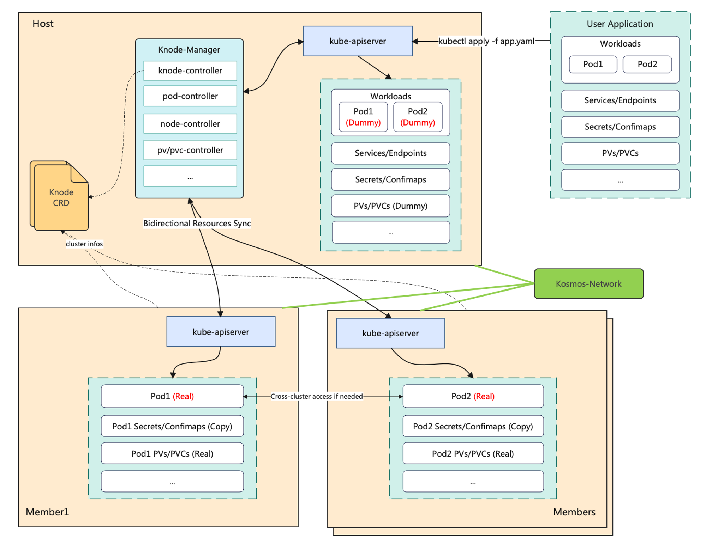

# KOSMOS

> [English](README.md) | 中文

Kosmos是移动云开源的分布式云原生联邦集群技术的集合，其名称kosmos：k代表**k**ubernetes，c**osmos**表示宇宙（希腊语），寓意kubernetes的无限扩展。目前，kosmos主要包括三大模块，分别是：**多集群网络**、**多集群管理编排**、**多集群调度**。此外，kosmos还配备一款kosmosctl工具， 可以快速进行kosmos组件部署、添加集群、测试网络连通性等工作。

## 多集群网络

Kosmos网络的目标是打通多个k8s集群之间的网络，该模块可以独立部署使用。Kosmos网络使`Pod`可以跨集群访问`Pod`、`Service`，就像它们在同一个集 群那样。目前，该模块主要具备以下功能：
1. **跨集群PodIP、ServiceIP互访**：基于Linux隧道技术，实现了多个k8s集群的L3网络互通，即用户可以在联邦集群范围内进行`Pod-to-Pod`、`Pod-to-Service`访问。
2. **多模式支持**：对于添加的集群，可以选择`P2P`或者`Gateway`模式，其中`P2P`模式适用于underlay网络互通情况，具有更短的网络路径和更优的性能。`Gateway`模式更具兼容性，适合混合云、多云场景。
3. **支持全局IP分配**：Kosmos网络允许在联邦集群中存在两个或多个集群使用相同的`Pod/Service`网段，便于用户对存量集群的管理。Kosmos支持配置`PodCIDR/ServiceCIDR` 与 `GlobalCIDR` 的映射关系，`GlobalIP`全局唯一，对于存在网段冲突的集群服务，可以通过`GlobalIP`互访。
4. **IPv6/IPv4 双栈支持**

### 网络架构

Kosmos多集群网络模块目前包含以下几个关键组件：
<div></div>

- `Controller-Manager`：用于收集所在集群的网络信息，监听网络设置的变化；
- `Network-manager`：用于计算各个节点需要的网络配置；
- `Agent`：是一个`Daemonset`，用于配置主机网络，例如隧道创建、路由、NAT等；
- `Multi-Cluster-Coredns`: 实现多集群服务发现；
- `Elector`：负责gateway节点选举；

### 快速开始

#### 本地启动
通过以下命令可以快速在本地运行一个实验环境，该命令将基于`kind`（因此需要先安装docker）创建两个k8s集群，并部署ClusterLink。
```bash
./hack/local-up-clusterlink.sh
```
检查服务是否正常运行
```bash
kubectl --context=kind-cluster-host-local get pods -nclusterlink-system
kubectl --context=kind-cluster-member1-local get pods -nclusterlink-system
```
确认跨集群网络是否打通
```bash
kubectl --context=kind-cluster-host-local exec -it <any-host-pod> -- ping <any-member1-pod-ip>
```

## 多集群管理编排
Kosmos多集群管理编排模块实现了Kubernetes的树形扩展和应用的跨集群编排。
<div></div>

目前主要支持以下功能：
1. **完全兼容k8s api**：用户可以像往常那样，使用 `kubectl`、`client-go`等工具与host集群的`kube-apiserver`交互，而`Pod`实际上是分布在整个多云多集群中。
2. **有状态应用、k8s-native应用支持**：除了无状态应用，Kosmos还支持对有状态应用和 k8s-native（与 `kube-apiserver`存在交互）应用的编排。Kosmos会自动检测`Pod`依赖的存储、权限资源，例如：pv/pvc、sa等，并自动进行双向同步。
3. **多样化Pod拓扑分布约束**：用户可以轻易的控制Pod在联邦集群中的分布，如：区域（Region）、可用区（Zone）、集群或者节点，有助于实现高可用并提升资源利用率。

## 多集群调度（建设中）
Kosmos调度模块是基于Kubernetes调度框架的扩展开发，旨在满足混合节点和子集群环境下的容器管理需求。这一调度器经过精心设计与定制，提供了以下核心功能，以增强容器管理的灵活性和效率：

1. **灵活的节点和集群混合调度**： Kosmos调度模块允许用户依据自定义配置，轻松地将工作负载在真实节点和子集群之间智能地调度。这使得用户能够充分利用不同节点的资源，以确保工作负载在性能和可用性方面的最佳表现。基于该功能，Kosmos可以让工作负载实现灵活的跨云跨集群部署。
2. **精细化的容器分发策略**： 通过引入自定义资源定义（CRD），用户可以精确控制工作负载的拓扑分布。CRD的配置允许用户明确指定工作负载的pod在不同集群中的数量，并根据需求调整分布比例。
3. **细粒度的碎片资源整理**： Kosmos调度模块能够智能感知子集群中的碎片资源，有效避免了pod被调度之后部署时子集群资源不足的情况。这有助于确保工作负载在不同节点上的资源分配更均匀，提升系统的稳定性和性能。

无论是构建混合云环境还是需要在不同集群中进行工作负载的灵活部署，Kosmos调度模块都可作为可靠的解决方案，协助用户更高效地管理容器化应用。

## 贡献者

<a href="https://github.com/kosmos-io/kosmos/graphs/contributors">
  
</a>

Made with [contrib.rocks](https://contrib.rocks).

## License
Copyright 2023 the KOSMOS Authors. All rights reserved.

Licensed under the Apache License, Version 2.0.