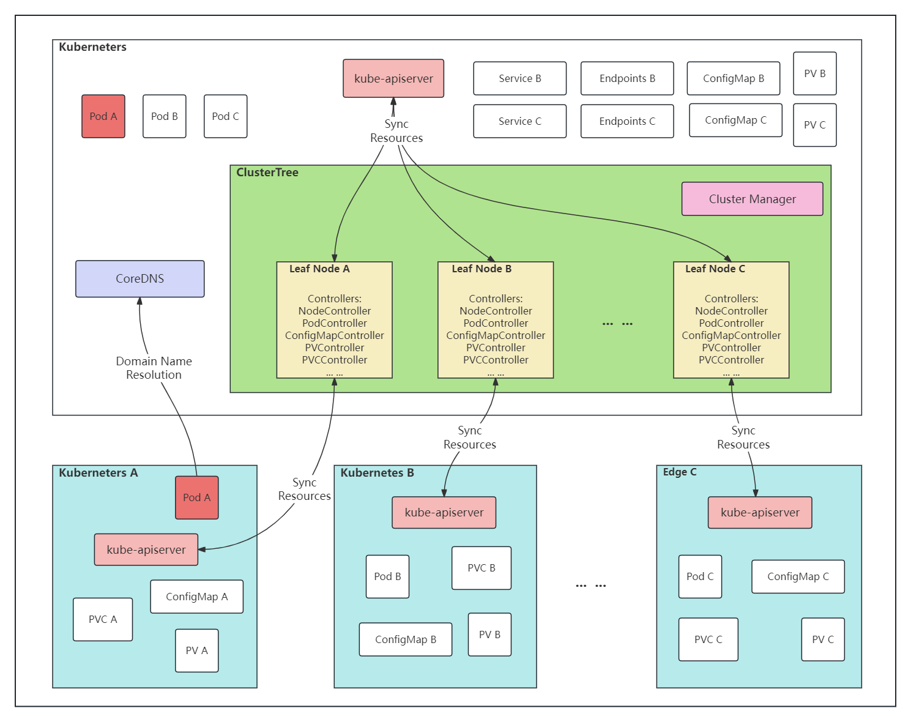

# Clustertree Node Resources

<!-- toc -->
- [Summary](#summary)
- [Motivation](#motivation)
  - [Goals](#goals)
  - [Non-Goals](#non-goals)
- [Proposal](#proposal)
- [Design Details](#design-details)
  - [Architecture](#architecture)
  - [Node Resources](#node-resources)
    - [API](#api)
    - [Init](#init)
    - [Reconcile](#reconcile)
  - [Node Lease](#node-lease)
    - [API](#api)
    - [Init](#init)
    - [Reconcile](#reconcile)
  - [Test Plan](###test-plan)
<!-- /toc -->

## Summary

- Add `node_resources_controller` in the KOSMOS ClusterTree to supports monitoring and regulating node resource usage from Leaf clusters.
- Add `node_lease_controller`  in the KOSMOS ClusterTree to manage node leases, ensuring that node leases are synchronized between the Leaf cluster and the Root cluster.

## Motivation
- Synchronize the node resources in the Leaf cluster to the node resources in the Root cluster for more accurate resource scheduling in the Root cluster.

### Goals
- Real-time synchronization and consistency of leaf cluster node resources and node information maintained by the root cluster.
- Ensure that node leases are synchronized between the Leaf cluster and the Root cluster to ensure the high availability and stability of the cluster.

### Non-Goals

## Proposal

## Design Details

### Architecture


### Node Resources
#### API
Add config to `NodeResourcesController`
```go
type NodeResourcesController struct {
	Leaf              client.Client
	Root              client.Client
	GlobalLeafManager leafUtils.LeafResourceManager
	RootClientset     kubernetes.Interface

	Nodes             []*corev1.Node
	LeafNodeSelectors map[string]kosmosv1alpha1.NodeSelector
	LeafModelHandler  leafUtils.LeafModelHandler
	Cluster           *kosmosv1alpha1.Cluster
	EventRecorder     record.EventRecorder
}
```

#### Init
In the `SetupWithManager` function, a `predicate.Funcs` object named `predicatesFunc` is specified using the `builder.WithPredicates` method to filter events that need to be processed. In this example, we only care about create, update, and delete events for Node objects.
```go
func (c *NodeResourcesController) SetupWithManager(mgr manager.Manager) error {
	return controllerruntime.NewControllerManagedBy(mgr). 
		Named(NodeResourcesControllerName). // A controller is created using the NewControllerManagedBy method, specifying the manager mgr and the controller `node-resources-controller`.
		WithOptions(controller.Options{}). // The controller options are set using the WithOptions method, which is empty in this case.
		For(&corev1.Node{}, builder.WithPredicates(predicatesFunc)). // The resource type to be processed is specified using the For method, which is corev1.Node objects, and the predicate predicatesFunc is passed in.
		Watches(&source.Kind{Type: &corev1.Pod{}}, handler.EnqueueRequestsFromMapFunc(c.podMapFunc())).
		Complete(c) // The controller configuration is completed.
}
```

#### Reconcile
The `Reconcile` function has the following reconciliation logic:
- Iterate over all Root nodes and get the information for each node.
- Use the methods of the LeafModelHandler interface to get the Leaf nodes and Pod lists corresponding to the current Root node in the Leaf cluster.
- Calculate the cluster resource allocation based on the information obtained.
- Use the CreateMergePatch function to generate a patch to update the Root node.
- Use the Patch method of the CoreV1 interface to update the Root node.
- Return an empty Result to indicate successful processing.

### Node Lease
#### API
Add config to `NodeLeaseController`
```go
type NodeLeaseController struct {
	leafClient       kubernetes.Interface
	rootClient       kubernetes.Interface
	root             client.Client
	LeafModelHandler leafUtils.LeafModelHandler

	leaseInterval  time.Duration
	statusInterval time.Duration

	nodes             []*corev1.Node
	LeafNodeSelectors map[string]kosmosv1alpha1.NodeSelector
	nodeLock          sync.Mutex
}
```

#### Init
In the `Start` function, two goroutines are started using the go keyword, which call the `syncLease` and `syncNodeStatus` functions, respectively.
```go
func (c *NodeLeaseController) Start(ctx context.Context) error {
	go wait.UntilWithContext(ctx, c.syncLease, c.leaseInterval) // In the syncLease function, the connection status with the Leaf cluster is first checked, then a lease is created (if it does not exist), and the lease is attempted to be updated.
	go wait.UntilWithContext(ctx, c.syncNodeStatus, c.statusInterval)
	<-ctx.Done()
	return nil
}
```

#### Reconcile
The `Reconcile` function has the following reconciliation logic:
- In the `Start` function, two goroutines are started using the go keyword, which call the `syncLease` and `syncNodeStatus` functions, respectively.
- In the `syncLease` function, the connection status with the Leaf cluster is first checked using the `leafClient`. If the connection fails, it is returned directly.
- Then, for each node, the following operations are performed:
  - A `namespaceName` object is constructed using the `rootClient` and the node name to get the `lease`.
  - The lease object is retrieved from the `rootClient` using the `namespaceName`.
  - If the lease object retrieved does not exist, a new lease object is created based on the node information and is created to the cluster using the `rootClient`.
  - If the lease object retrieved exists, the `RenewTime` field of the lease object is updated and is updated to the cluster using the `rootClient`.
- In the `syncNodeStatus` function, all nodes are first copied (to avoid concurrent modification of the original node list), and then the updateNodeStatus function is called to update the node status.
- In the `updateNodeStatus` function, the UpdateRootNodeStatus function of the `LeafModelHandler` interface is called to update the node status in the `Root` cluster.
- Finally, in the `NodeLeaseController` constructor `NewNodeLeaseController`, some initial values are set for the controller and the `NodeLeaseController` object is returned.

### Test Plan