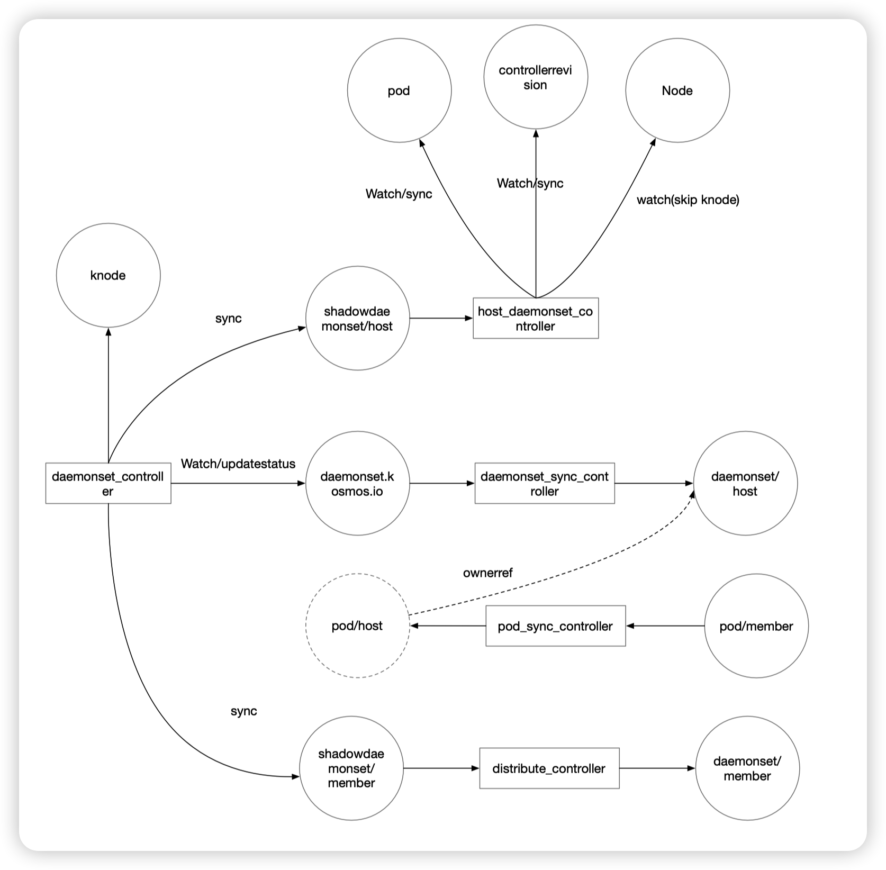

# extersion: kosmos daemonset

## Summary
为kosmos提供daemonset跨集群部署能力

## Motivation
某些产品部署过程中会使用到daemonset并且需要支持跨集群部署，同时需要提供与原生daemonset一致到体验

### Goals
- 实现与原生daemonset体验一致的跨集群daemonset

### Non-Goals
- 并不打算取代原生的daemonset

## Proposal
### User Stories (Optional)

## Design Details
### Architecture

####新增2个CRD   
daemonset.kosmos.io: 用于描述跨集群daemonset的CRD  
shadowdaemonset.kosmos.io: 为每一个集群创建一个shadowdaemonset，用于描述原生daemonset的CRD  
####新增5个controller
host_daemonset_controller: 功能与k8s中的daemonset_controller一样，只是调和对象由daemonset变为了主集群的shadowdaemonset.kosmos.io
daemonset_controller: 用于调和daemonset.kosmos.io, 会生成一个主集群的shadowdaemonset.kosmos.io, 然后基于knode生成与之关联的shadowdaemonset.kosmos.io  
distribute_controller: 基于描述子集群的shadowdaemonset.kosmos.io在子集群中生成真正的daemonset并同步状态  
daemonset_sync_controller: 在兼容性模式下使用，通过将用户在主集群创建的daemonset同步创建关联的daemonset.kosmos.io, 以保证用户在不做调整的前提下，使用全局daemonset的能力 
pod_sync_controller: 将子集群的与daemonset关联的pod反向同步到主集群中，进一步提升一致性体验（option）  

### Test Plan
