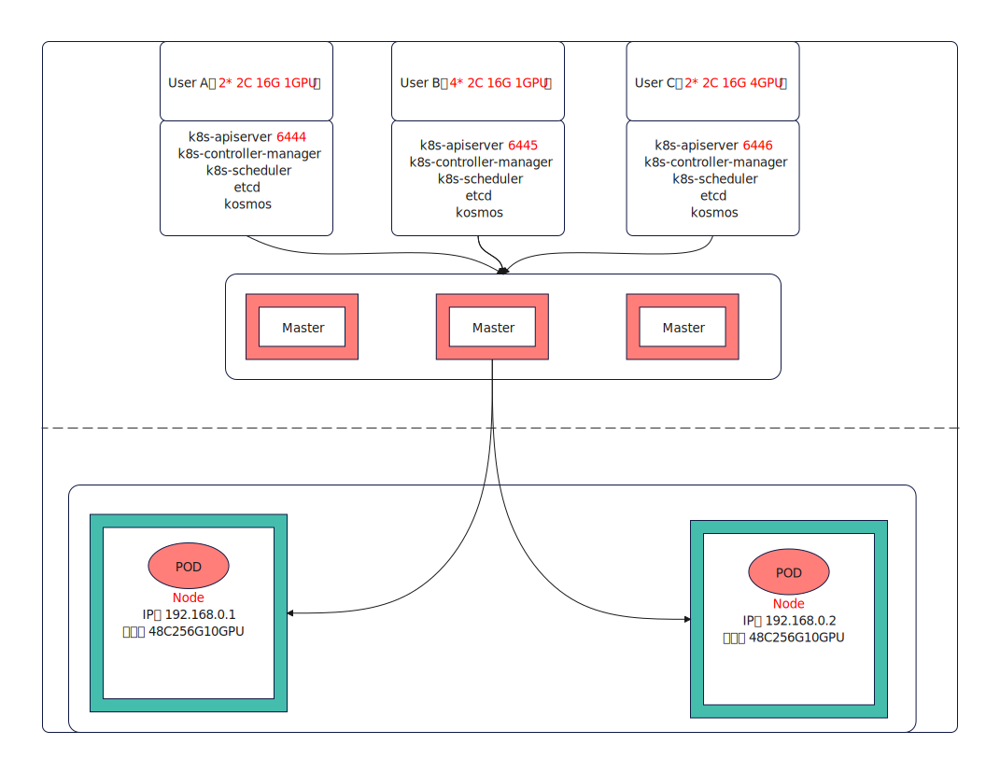

# Summary

Kosmos now supports the management of different Kubernetes (k8s) clusters, offering a unified control plane view for resource management and scheduling. This proposal introduces a method to achieve Kubernetes within Kubernetes (k8s in k8s) using Kosmos.

The approach involves creating different Kubernetes control plane services within a single k8s cluster and deploying Kosmos' ClusterTree service. The ClusterTree listens to the kube-apiserver address of the created k8s control plane and incorporates the current cluster as a node into the dynamically created control plane. Each control plane has its exclusive etcd, ensuring the isolation of permissions and data for different tenants.

# Motivation

In some cases, cloud providers offer a large k8s cluster as infrastructure to different tenants, providing computational resources like CPU and GPU. Therefore, a k8s in k8s solution is required to isolate permissions and data for different tenants.

## Goals

Divide the computational power of a single k8s cluster into multiple distinct k8s clusters, achieving permission and data isolation for different tenants.

## Non-Goals

# Proposal

Implement a k8s in k8s solution with Kosmos, allocating a single cluster's computational resources to different tenants.

## Function Overview

1. Enable splitting a single cluster into different smaller clusters through Kosmos.
2. Provide tenants with exclusive etcd and k8s control planes to ensure complete isolation of permissions and resources.
3. Ensure tenants' control planes offer the same functionalities as a single k8s control plane, without changing the user experience.

## User Stories (Optional)

### Story 1

Imagine a supercluster with tens of thousands of nodes, hosting many different tenants. These tenants do not require all the computational resources of the entire k8s cluster, and for security reasons, it's crucial to ensure complete permission isolation between tenants. The native RBAC permission isolation solution in k8s might be insufficient, and k8s's reliance on namespaces for resource isolation could alter the user experience, restricting operations to the namespace level, which could be user-unfriendly.

# Design Details

## Overall Architecture



As shown in the figure, each tenant has a separate k8s control plane and etcd. Each tenant's k8s control plane uses Kosmos to manage the nodes of the current cluster as virtual nodes for the control plane. The CRD configuration determines the number of nodes from the current cluster each control plane should manage.

## CRD Design

```yaml
apiVersion: kosmos.io/v1alpha1
kind: VirtualCluster
metadata:
  name: tenant1-cluster
spec:
  kubeconfig: XXXXXX
  promoteResources:
    nodes:
    - node1
    - node2
    resources:
      cpu: 10
      memory: 100Gi
status:
  phase: Initialized
```

## Overall Process

1. A cluster administrator creates a VirtualCluster CR resource.
2. The Kosmos-operator listens for the creation of the VirtualCluster, starts the creation of the Kubernetes control plane services including the kube-apiserver, kube-controller-manager, kube-scheduler, and etcd. Once the Kubernetes control plane services are setup, the VirtualCluster's status.phase will be set to Initialized, and the spec.kubeconfig field will be populated.
3. After the control plane is set up, the Kosmos-operator creates the Kosmos clusterTree service and configures the clusterTree's apiserver address to the current control plane using the kubeconfig value from the VirtualCluster.
4. Once the clusterTree is ready, the Kosmos-operator manages the tenant's required node resources or computational resources like CPU and memory into the tenant's control plane based on the VirtualCluster's promoteResource configuration. Tenants can then manage resources in the control plane using the spec.kubeconfig.

# Test Plan

## Unit Test

## E2E Test

| Test Case                     | Case Description                                              |
| ----------------------------- | ------------------------------------------------------------- |
| Virtual Control Plane Creation | Test the creation of a virtual control plane through the VirtualCluster CRD |
| Service Creation in Virtual Control Plane | Test the creation of services in the virtual control plane and their external functionality |
