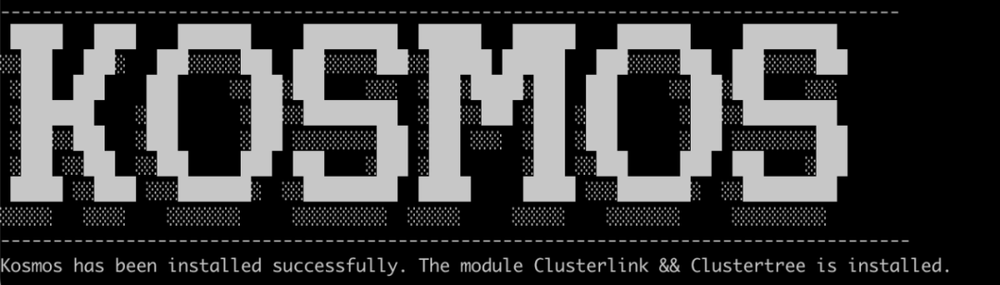

# Kosmos离线部署
针对网络环境受限，无法访问外网的情况，Kosmos提供离线部署方案，本文将以v0.2.0版本为例，讲述如何在离线环境中部署Kosmos。（开始以下步骤之前，请确保有可用的Kubernetes集群环境）。

Kosmos 项目链接：https://github.com/kosmos-io/kosmos


## 一.  在能够连接外网的机器上

在进行离线部署之前，需要在可以访问外网的机器上拉取Kosmos所必须的镜像包。

### 步骤一：安装kosmosctl

`kosmosctl` 也是允许你控制 kosmos 命令行工具，可以通过该命令行工具实现镜像的快速下载，根据操作系统选择合适的`kosmosctl`工具包，以 `kosmosctl-linux-amd64` 为例。

1. 执行下述指令下载命令行工具包：

   ```shell
   curl -L -O https://github.com/kosmos-io/kosmos/releases/download/v0.3.0/kosmosctl-linux-amd64
   ```

2. 将其移至`/usr/bin`目录下，并赋予执行权限：

   ```shell
   sudo mv ./kosmosctl-linux-amd64 /usr/local/bin/kosmosctl
   sudo chmod +x /usr/local/bin/kosmosctl
   ```

3. 验证`kosmosctl` 命令行工具是否有效：

   ```shell
   kosmoctl -h
   ```

其他版本详见：https://github.com/kosmos-io/kosmos/releases


### **步骤二：准备安装镜像**

`kosmosctl`支持docker和containerd两种方式拉取部署Kosmos所需要的镜像。

- docker

  ```shell
  # 默认拉取最新的镜像
  kosmosctl image pull
  # 拉取指定版本的镜像
  kosmosctl image pull --kosmos-version=v0.3.0 --eps-version=v0.1.1 --coredns-version=v0.1.8
  ```

- containerd

  ```shell
  # 默认拉取default命名空间下最新的镜像
  kosmosctl image pull --containerd-runtime=containerd
  # 拉取k8s.io命名空间下特定版本的镜像
  kosmosctl image pull --containerd-runtime=containerd --containerd-namespace=k8s.io --kosmos-version=v0.3.0 --eps-version=v0.1.1 --coredns-version=v0.e1.8
  ```

`kosmosctl`在拉取镜像后，会在当前目录下生成`kosmos-io.tar.gz`

参数说明：

- `--containerd-runtime`，定义机器容器运行时，支持docker和containerd，默认docker；
- `--containerd-namespace`，表示containerd拉取镜像时的命名空间；
- `--kosmos-version`，表示kosmos相关镜像的版本，默认latest；
- `--eps-version`，表示eps-probe-plugin镜像的版本，默认latest；
- `--coredns-version`，表示coredns镜像的版本，默认latest。


## 二. 在无法连接外网的机器上

### 步骤三：拷贝压缩包

将上述`kosmosctl`命令行工具和`kosmos-io.tar.gz`压缩包拷贝至无法连接外网的机器上，同时执行：

```
sudo mv ./kosmosctl /usr/local/bin/kosmosctl
sudo chmod +x /usr/local/bin/kosmosctl
```

### 步骤四：准备私有镜像库

1. 前提：机器能够访问私有镜像仓库，以docker仓库作为示例。

2. 配置镜像仓库

   修改`/etc/hosts` 文件:

   ```shell
   vim /etc/hosts
   ```

   在host文件中将主机名（即仓库域名；在本示例中是 registry.local.com）映射到机器的私有 IP 地址:

   ```shell
   # registry(xxx.xxx.xxx.xxx 表示具体ip地址)
   xxx.xxx.xxx.xxx registry.local.com
   ```

   使用镜像仓库的`username`和`password`登录镜像仓库：

   ```
   docker login --username=[用户名] registry.local.com
   ```

3.验证镜像仓库是否有效

使用 `docker push` 和 `docker pull` 来测试。


### **步骤五：推送镜像至私有镜像仓库**

`kosmosctl`支持docker和containerd两种方式推送Kosmos部署所需要的镜像到私有镜像仓库。

- docker

  ```shell
  kosmosctl image push --artifact=[*/kosmos-io.tar.gz] --private-registry=registry.local.com --username=[用户名]
  ```

- containerds

  ```shell
  kosmosctl image push --artifact=[*/kosmos-io.tar.gz] --containerd-runtime=containerd --containerd-namespace=k8s.io --private-registry=registry.local.com --username=[用户名]
  ```

  执行上述命令，输入镜像仓库的`password`，开始推送镜像

参数说明：

- --artifact，表示`kosmos-io.tar.gz` 的路径；
- --private-registry，表示私有镜像仓库的地址。


### **步骤六：开始安装**

镜像推送成功后，开始安装Kosmos，执行指令：

```shell
# 默认安装最新的镜像
kosmosctl install --private-image-registry=registry.local.com
# 指定镜像版本安装
kosmosctl install --private-image-registry=registry.local.com --kosmos-vesion=0.2.0
```


### **步骤七：验证安装**

安装成功后，会出现下述界面：




## **三. 补充功能**

`kosmoctl`不光能够下载Kosmos部署相关镜像，还能够帮助下载自定义镜像。

1. 准备镜像清单`image-list.txt`（以Kosmos v0.3.0为例）

   ```txt
   ghcr.io/kosmos-io/clustertree-cluster-manager:v0.3,0
   ghcr.io/kosmos-io/clusterlink-operator:v0.3.0
   ghcr.io/kosmos-io/clusterlink-agent:v0.3.0
   ghcr.io/kosmos-io/clusterlink-network-manager:v0.3.0
   ghcr.io/kosmos-io/clusterlink-controller-manager:v0.3.0
   ghcr.io/kosmos-io/clusterlink-proxy:v0.3.0
   ghcr.io/kosmos-io/clusterlink-elector:v0.3.0
   ghcr.io/kosmos-io/clusterlink-floater:v0.3.0
   ```

2. 下载镜像指令

   ```shell
   # docker指令
   kosmosctl image pull --image-list=[image-list.txt]
   # containerd指令
   kosmosctl image pull --image-list=[image-list.txt] --container-runtime=containerd --containerd-namespace=k8s.io
   ```

3. 推送镜像指令

   ```shell
   # docker指令
   kosmosctl image push --image-list=[image-list.txt] --artifact=[*/kosmos-io.tar.gz] --private-registry=registry.local.com --username=[用户名]
   # containerd指令
   kosmosctl image push --image-list=[image-list.txt] --artifact=[*/kosmos-io.tar.gz] --containerd-runtime=containerd --containerd-namespace=k8s.io --private-registry=registry.local.com --username=[用户名]
   ```

   执行指令，输入镜像仓库`password`，推送镜像。


## 参考文献：

1. [Kosmos实现无状态工作负载跨集群平滑扩展](https://mp.weixin.qq.com/s/6zZXPP9FKbgWV1JUYv-iVw)
2. https://github.com/kosmos-io/kosmos