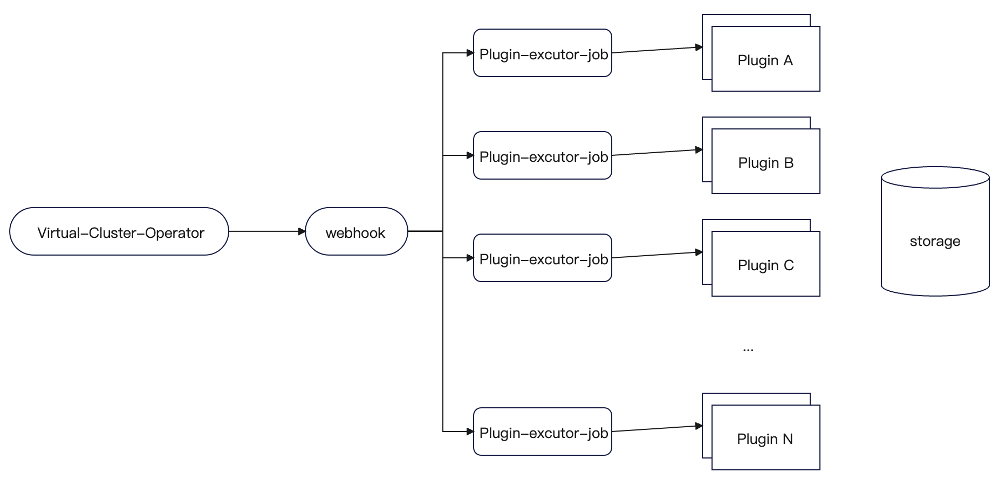

# Summary

目前的kubenest在创建virtualcluster的时候，需要根据不同的场景创建集群中的插件，除了k8s内置的组件外，其他像node-local-dns、apiserver-network-proxy等增强功能，我们没办法在代码中写死这些代码，需要提供插件化的方式安装这些。

# Motivation

提供插件化的集群组件安装方式

## Goals

使用CRD描述插件，每个插件使用单独的CR表示。在创建集群的时候，可以在virtualCluster中指定需要安装或者不需要安装的插件。当安装集群的状态为AllNodeReady的时候，开始安装virtualCluster中配置的需要安装的插件。当所有插件都完成安装后（如何判断插件安装成功，还是暂时先不判断），virtualCluster的状态变为competed。

## Non-Goals

# Proposal

提供Kube in kube 方案的插件化安装组件方式 

## Function overview

1. 通过virtualCluster指定要安装或不安装的插件

2. 定义插件的CRD,支持多种方式的插件安装

3. 判断插件安装成功之后将集群的状态设置为completed

## User Stories (Optional)

## story 1

# Design Details

## 整体架构



virtual-cluster-operator: 监听VirtualCluster资源，并创建控制面和Plugin-excutor-job

webhook：根据virtualCluster 和VirtualClusterPlugin的配置动态注入Plugin-excutor-job的yaml，将pv或hostpath注入进去

Plugin-excutor-job：ansible-operator，内置helm，kostumize，kubectl等工具，负责安装VirtualClusterPlugin的配置的插件，并根据successCmommand的命令判断是否安装成功。如果不填就不判断。

Plugin： plugin是个crd，配置yaml或helm文件的存储位置及参数等

storage： storage是plugin文件的存储位置，包含hostpath，pv，对象存储，url等存储方式

## CRD设计

一、VirtualCluster增加插件相关字段

```YAML
apiVersion: kosmos.io/v1alpha1
kind: VirtualCluster
metadata:
  name: tenant1-cluster
spec:
  kubeconfig: XXXXXX
  promoteResources:
    nodes:
    - node1
    - node2
    resources:
      cpu: 10
      memory: 100Gi
  pluginSet:
    enabled:
      - name: pluginA
      - name: pluginB
    disabled:
      - name: pluginC

```

通过pluginSet指定需要安装和不需要安装的插件

二、增加VirtualClusterPlugin 的CRD

```YAML
apiVersion: kosmos.io/v1alpha1
kind: VirtualClusterPlugin
metadata:
  name: apiserver-network-proxy
spec:
  successStateCommand: "kubectl get pods -n default -l app=test --field-selector=status.phase!=Running | grep -q 'No resources found' && echo "所有的Pod都处于Running状态。" || echo "有Pod不处于Running状态。""
  pluginSources:                    
    chart:                          
      name: xxx             
      repo:  xxx             
      storage: 
        pvPath: /root
        hostPath: /root
        uri: https://XXXX.yaml
      values:  xxx           
      valuesFile: 
        pvPath: /root
        hostPath: /root
        uri: https://XXXX.yaml
    yaml: 
      path:            
        pvPath: /root
        hostPath:
          path: /root
          nodeName: node1
        uri: https://XXXX.yaml
```

## 整体流程

以使用pv方式存储部署文件为例

1. 创建绑定pv的服务

```YAML
apiVersion: apps/v1
kind: StatefulSet
metadata:
  name: ubuntu-statefulset
spec:
  serviceName: "ubuntu"
  replicas: 1
  selector:
    matchLabels:
      app: ubuntu
  template:
    metadata:
      labels:
        app: ubuntu
    spec:
      containers:
      - name: ubuntu
        image: ubuntu
        command: ["sleep", "infinity"]
        volumeMounts:
        - mountPath: "/pv"
          name: plugin-store
  volumeClaimTemplates:
  - metadata:
      name: plugin-store
    spec:
      accessModes: [ "ReadWriteOnce" ]
      storageClassName: "openebs-hostpath"
      resources:
        requests:
          storage: 1Gi

```

1. 查看pv

```Shell
pvc-bdac7fb6-a311-46a1-85ea-85099372a73e   1Gi        RWO            Delete           Bound    default/plugin-store-ubuntu-statefulset-0   openebs-hostpath            8s
```

1. 拷贝部署文件到pv

```Shell
kubectl cp test.yaml ubuntu-statefulset-0:/pv
```

1. 创建plugin

```YAML
apiVersion: kosmos.io/v1alpha1
kind: VirtualClusterPlugin
metadata:
  name: apiserver-network-proxy
spec:
  pluginSources:                    
    yaml: 
      path:            
        pvPath: plugin-store-ubuntu-statefulset-0:/pv
```

这边没有设置successCommand,因此virtual-cluster-operator在部署的时候是直接apply的，不会根据successCommand判断是否创建成功

如果是需要动态传参部署插件，则必须选择helm或者kostumize的方式，yaml方式只支持直接apply，不支持动态传参。

1. 整体流程分析

用户到一个新环境，就将plugin提前创建好。

后续当创建VirtualCluster的CR时，operator会根据vc里配置的plugin安装组件。安装时，每个plugin的安装会创建一个叫做plugin-excutor-job的job安装插件。

job的示例：

```Shell
apiVersion: batch/v1
kind: Job
metadata:
  name: apply-yaml-job
spec:
  templat
    spec:
      containers:
      - name: kubectl-container
        image: bitnami/kubectl  
        command: ["kubectl", "apply", "-f", "/mnt/example.yaml"]  
        volumeMounts:
        - name: mypvc
          mountPath: /pv
      restartPolicy: Never
      volumes:
      - name: mypvc
        persistentVolumeClaim:
          claimName: plugin-store-ubuntu-statefulset-0
  backoffLimit: 4
```

如果plugin设置了sucessCommand，则启动命令需要先执行完部署任务之后加上wait successCommand的命令。

所有plugin的job执行完毕之后更新VirtualCluster的状态为completed。

# Test plan

## Unit Test

## E2E Test


