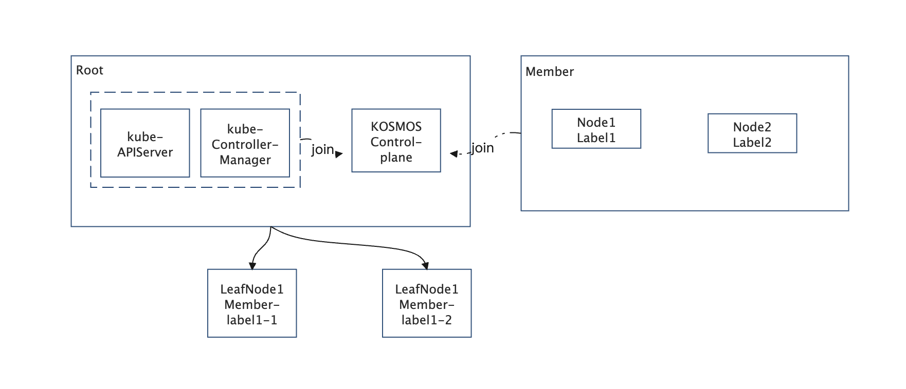

# Kosmos ClusterTree leaf node generate rules

## Summary
Provide a member cluster to pretend one or more Leaf Nodes in clusterTree by some rules like Node labelSelector

## Motivation & User Stories
1、Some products can provide idle Nodes to join Kosmos
2、Some products want an easy way to make a second level pod schedule in their member clusters.

## Design Details
### Architecture
